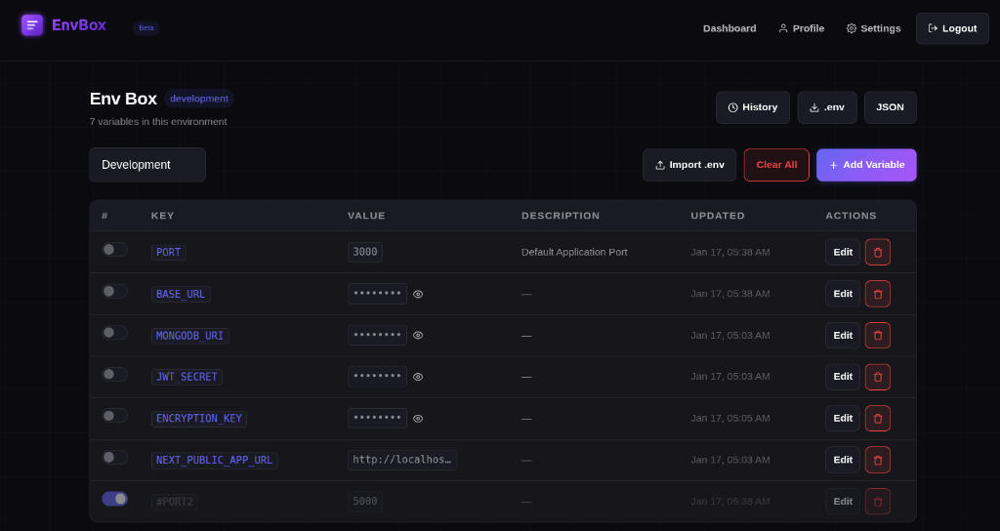

<p align="center">
  
</p>

<p align="center">
  <b>The modern, encrypted, and collaborative way to handle .env files across your entire development lifecycle.</b>
</p>

<p align="center">
  
  
  
  
</p>

---



## ✨ Features

- 🔐 **End-to-End Encryption**: Variables are encrypted using AES-256 before being stored.
- 👥 **Team Collaboration**: Granular roles (Admin, Member) and download permissions.
- 🌍 **Environment Management**: Seamlessly switch between Development, Staging, and Production.
- 🛡️ **Variable Masking**: Prevent accidental exposure of sensitive keys with immutable masking.
- 📥 **.env Import/Export**: Bulk import existing files and export securely when needed.
- 📜 **Audit Logs**: Track every change made to your environment variables.

## 🚀 Quick Start

### 1. Clone & Install
```bash
git clone https://github.com/your-repo/env-box.git
cd env-box
npm install
```

### 2. Configure
```bash
cp .env.example .env
# Update MONGODB_URI, JWT_SECRET, and ENCRYPTION_KEY
```

### 3. Run
```bash
# Start MongoDB (if using Docker)
docker run -d -p 27017:27017 --name mongodb mongo:latest

# Start Dev Server
npm run dev
```

## 🛠️ Tech Stack

- **Frontend**: Next.js 14 (App Router), React, CSS Modules
- **Backend**: Next.js API Routes, MongoDB (Mongoose)
- **Security**: JWT, AES-256 Encryption, Bcrypt
- **Design**: Custom Glassmorphism UI, Inter Typography

## 📦 Deployment

EnvBox is optimized for **Vercel**. Check out our [Vercel Deployment Guide](.gemini/antigravity/brain/f4f331d4-953f-47b2-b722-d850fdfc4183/vercel_deployment.md) for more details.

---

<p align="center">
  Built with ❤️ by the EnvBox Team
</p>
